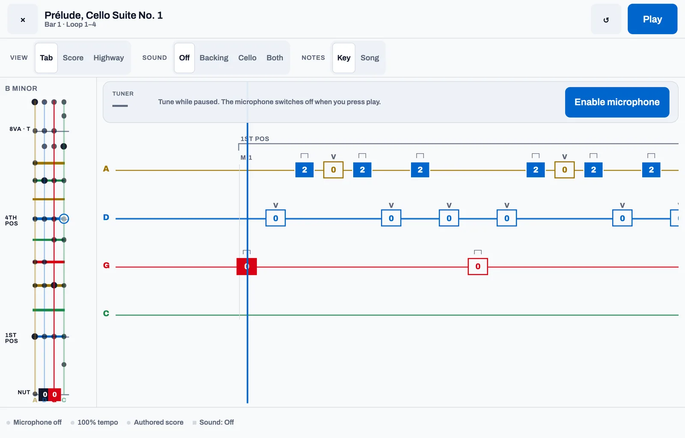
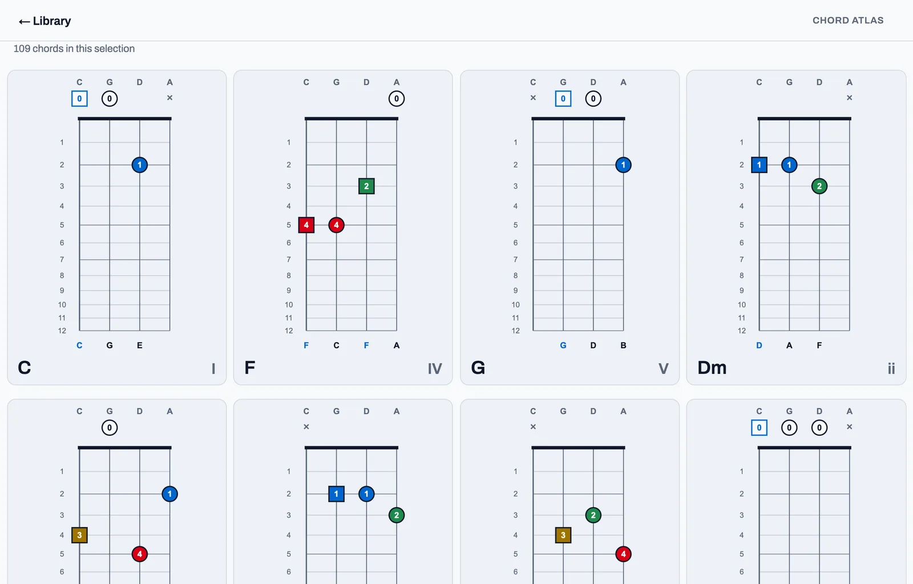
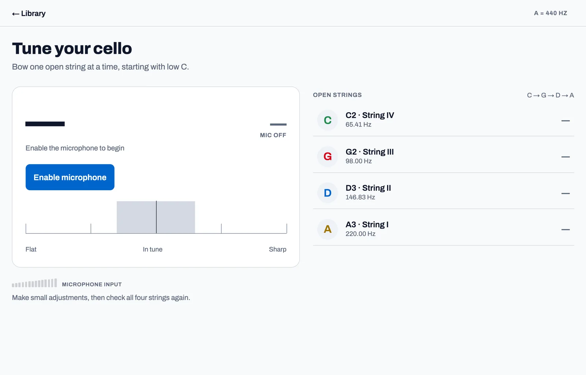
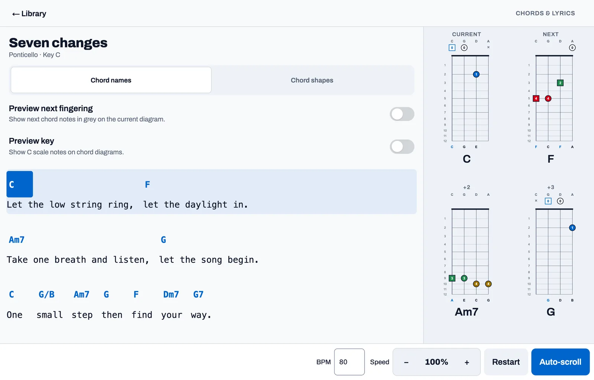

<p align="center">
  
</p>

<h1 align="center">Ponticello</h1>

<p align="center"><em>Practice, not points.</em></p>

<p align="center">
  <a href="docs/index.html">Product site</a> ·
  <a href="#contributing">Contributing</a> ·
  <a href="#build-your-own-library">Build your own library</a> ·
  <a href="#rights">Rights</a>
</p>

Offline intonation practice for acoustic cello. Listens to the instrument
through the device microphone, shows what you are supposed to play three
different ways, and tells you how far off the note you are — in cents, in real
time. No accounts, no scores, no streaks, no network.

Laid out for the **Galaxy Z Fold 5 inner display (2176 × 1812)**, and scales
from there to the cover screen, a phone, or a browser window.

```bash
npm install
npm run web        # browser — real microphone
npm run android    # device or emulator
npm run ios
npm test           # pure TypeScript unit + exhaustive catalogue playback tests
npm run typecheck
```

<p align="center">
  
</p>

<p align="center">
  
  
  
</p>

---

## What is here

| Screen             | What it does                                                                                                               |
| ------------------ | -------------------------------------------------------------------------------------------------------------------------- |
| **Library**        | Everything you can play: the authored studies and public-domain works, your MIDI imports, and any chord charts.            |
| **Tutorial**       | Static. Explains the nut, the finger numbers, your own tape colours, and how to read each vision.                          |
| **Practice sheet** | A/B loop by bar, tempo 40–120 %, fingering blackout, tape overlay, cue density.                                            |
| **Play**           | Three visions — Tab, Score, Highway — over a fixed fingerboard panel and cents rail, with the backing sounding underneath. |
| **Import**         | Bring your own MIDI; the app fingers the cello line and makes a backing from the rest.                                     |
| **Tuner**          | Open strings, off the same pitch engine the play screens use.                                                              |
| **My tapes**       | The tape colours and positions on _your_ fingerboard. Everything else follows them.                                        |

---

## The tapes

The app is built around one player's fingerboard tapes and says so everywhere:

| Set            | Colours, nut outwards          | Fingers | Semitones   | Millimetres from the nut |
| -------------- | ------------------------------ | ------- | ----------- | ------------------------ |
| First position | blue · yellow · yellow · green | 1 2 3 4 | 2 3 4 5     | 75 · 110 · 142 · 173     |
| Thumb position | blue · green · green · yellow  | T 1 2 3 | 12 14 16 17 | 345 · 383 · 416 · 432    |

Two assumptions are baked into those defaults, both editable in **Settings →
My tapes**:

- **First position** is read as the closed hand frame — four fingers a semitone
  apart, first finger to little finger spanning a minor third. The two yellows
  are the middle fingers, which is what makes them distinguishable in practice:
  the tape narrows the note to a semitone and the string finishes the job.
- **Thumb position** is read as the thumb on the octave harmonic at exactly
  half the string, with fingers 1–3 climbing a major tetrachord above it
  (whole, whole, half — A B C♯ D on the A string). If your teacher set the
  frame differently, change the semitone values and every diagram, note name
  and colour in the app follows.

Distances come from `stopDistanceMm(n) = L · (1 − 2^(−n/12))` with L = 690 mm,
so every fingerboard drawing is a true scale drawing rather than an evenly
spaced diagram. The tapes crowd together as they climb because the string does.

---

## Resolution model

Everything is written in **design units**, where the canvas is 829 × 690 —
2176 × 1812 physical pixels at the Fold 5's native density of 2.625.

```shell
src/theme/scale.ts    CANVAS = FOLD5_PX / FOLD5_DENSITY
                      scale  = min(window.width / 829, window.height / 690)
```

On the unfolded inner display that scale is exactly 1.0 and the layout lands
pixel-exact. Everywhere else the same canvas scales to fit, so there is only
ever one layout to reason about. `useTheme()` exposes `s(units)` for sizes,
`font(units)` with a legibility floor, and `rule(units)` clamped to the device
hairline. Tap targets never scale below 44 dp.

Running `npm run web` in a desktop browser runs full screen by default,
scaling and reflowing responsively (`src/components/DeviceCanvas.tsx`).
A floating pill button (or pressing `f`) lets you toggle into the Fold 5
preview frame to inspect the layout exactly as it lands on the physical device.

---

## Audio pipeline

```bash
microphone ─┬─ high band  48 kHz · 512-window · 190–1000 Hz ─┐
            │                                                ├─ arbiter ─→ cents
            └─ ÷4 → 12 kHz · 512-window ·  55–220 Hz ────────┘
```

A cello spans C2 (65 Hz) to A5 (880 Hz). One analysis window cannot serve both
ends — long enough to see a C2 period means 43 ms of lag on everything, and
short enough to feel instant up high cannot see a single period down low. So
the signal is analysed twice in parallel at two rates and an arbiter decides
which branch to believe. The bands overlap between 190 and 220 Hz on purpose,
so the handover around the open A is a preference rather than a cliff.

**Pitch detection is the McLeod method over the Normalised Square Difference
Function** (`src/audio/mpm.ts`). Not FFT peak-picking: a bowed cello radiates
almost no energy at its own fundamental down at C2, because the body's air and
wood resonances sit well above 65 Hz, so the second and third harmonics are
louder than the note itself. Anything that picks the loudest spectral peak
reports C3. A time-domain difference function keys on the _period_, which
survives a missing fundamental intact — there is a test for exactly this case.

Other pieces worth knowing about:

- **`fft.ts`** — radix-2 FFT with cached twiddles. The NSDF's autocorrelation
  goes through Wiener–Khinchin rather than an O(W²) sum, and the same transform
  serves the onset gate.
- **`decimate.ts`** — 4th-order Butterworth at 1 kHz before the ÷4 drop.
  Deliberately not the ~300 Hz the low band's range suggests: at 220 Hz a
  300 Hz corner would leave nothing but the fundamental, which is the partial
  the instrument under-radiates.
- **`flux.ts`** — half-wave-rectified spectral flux. During the first 15–40 ms
  of a bow stroke the string has not settled into Helmholtz motion and the
  detector returns confident nonsense, so flux spikes freeze the display
  instead.
- **`PitchEngine.ts`** — ring buffers, the arbiter, and a cents smoother. The
  arbiter's most important rule: if the low band hears half what the high band
  hears, the high band has locked onto the second harmonic; trust the low one.

### Capture

| Platform      | Source                                                              | Status   |
| ------------- | ------------------------------------------------------------------- | -------- |
| iOS / Android | `expo-audio`'s `AudioStream` — real PCM from AVAudioEngine / AAudio | working  |
| Web           | `AudioWorklet` posting 256-sample blocks (`useMicSource.web.ts`)    | working  |
| anything else | reports "no microphone", app still runs                             | fallback |

Web capture sets `echoCancellation`, `noiseSuppression` and `autoGainControl`
all to false. They are tuned for speech and actively destroy a bowed cello: AGC
pumps between strokes and noise suppression treats a sustained low C as
stationary noise.

The original architecture called for a C++ JSI TurboModule with SIMD. That is
not here and is not currently needed — `AudioStream` delivers float PCM from
the platform audio unit, and the analysis window (10–43 ms) dwarfs the bridge
hop. Revisit it if profiling ever says otherwise.

---

## Rendering

Plain React Native views and `react-native-svg`, driven by Reanimated. Not
Skia: this design is flat rectangles, hard rules and text, with one curve in
it (the intonation ribbon). Skia would have added a CanvasKit WASM payload on
web and a config plugin on native to draw shapes `<View>` already draws.

Each vision lays out its whole note field once at fixed offsets and moves it
with a **single transform** per frame, so scrolling costs one animated style no
matter how many notes are on screen. The transport (`usePlayhead.ts`) advances
score time inside a Reanimated frame callback on the UI thread; React only
learns which note is active, and only about fifteen times a second.

### One deliberate departure from the design mock

The mock drew fingerboard position rules across the Highway. Here the
Highway's vertical axis is **time and nothing else** — a highway whose vertical
axis means distance-from-nut in the background and seconds-until-you-play-it in
the foreground cannot be read at speed. The tape a note lands on travels _with
the note_, as a coloured bar on the edge of its capsule, and the fingerboard
panel beside the highway keeps the distance axis where it belongs.

### Note overlay on the fingerboard

A button at the top of the fingerboard panel cycles the faint note overlay
through three states. **NOTES OFF** shows only the tapes and the live note.
**KEY** paints every stopping point that belongs to the song's key across all
four strings, with the tonic drawn larger and brighter — a whole-neck shape to
improvise in and learn the key by. **SONG** paints only the pitch classes the
piece actually uses, so the shape of what is coming is visible before the bow
moves. The key is detected from the notes themselves by the
Krumhansl–Schmuckler correlation (`src/domain/key.ts`), because the bundled
compact scores do not store one; the caption names the key it found.

---

## Scores

`src/domain/schema.ts` defines `CelloSongScore` v1.0.0. Authored scores go
through `src/scores/build.ts`, which derives pitch name, MIDI number, frequency
and start time from the decisions a musician actually makes — which string, how
far up it, which finger, how long — and throws on a bar whose durations do not
add up.

### Adding a piece

```
npm run convert -- path/to/piece.mid --title "Piece" --composer "Someone" --bpm 84
```

`tools/convert-score.ts` uses the same pure arranger as on-device import and the bundled-library build. Beginner selects held bass anchors; Intermediate selects a bass part or the lowest voice of a keyboard texture. Advanced and Full rank recurring themes/riffs, weighting how much of the song a track covers. Octave displacement seats the line in a low register before first-position fingerings are assigned. Open-string pitches always use their open string. Add the emitted module to `CORE_SCORES` in `src/scores/library.ts` to show it in the library.

### Arrangement levels

Each MIDI-derived piece stores its full lowered melody, a source bass/lower voice, and a sparse harmonic guide. The practice sheet derives four parts:

| Level            |      Attack ceiling | Register and role                   |
| ---------------- | ------------------: | ----------------------------------- |
| **Beginner**     |         1.5 notes/s | C2–G3; held bass anchors and drones |
| **Intermediate** |           3 notes/s | C2–A3; simple bass accompaniment    |
| **Advanced**     |           5 notes/s | C2–D4; reduced melody               |
| **Full**         | every selected note | C2–D4; full melody rhythm           |

All four use first/half position. Beginner and Intermediate avoid extended hand frames; the melody levels allow occasional extensions for chromatic notes. Rhythmic reduction tightens further if the measured difficulty exceeds the selected level. Beginner and Intermediate omit awkward changes and keep consecutive pitches within a fifth; the melody levels allow an octave. Beginner holds stop with the source bass or a change of harmony, preserve audible rests, and split long drones into bow lengths of at most four seconds. A single drone is a valid part. The backing retains the source melody while the cello plays accompaniment. Octave changes preserve the song's pitch classes, including modulations and chromatic harmony, without retuning or transposing the backing.

Phrase starts, downbeats, long/loud notes, contour turns, and recurring-riff anchors guide rhythmic reduction. The same score drives Tab/Score/Highway and **Cello** playback. Full still contains fast rhythms; its difficulty comes from bowing and reading rather than mandatory high positions. The dedicated Thumb Position Ladder remains an explicitly labelled technique study.

Rebuild with `npm run build:library`, then run `npm run audit:arrangements` for all 1,032 song parts and the six authored studies/excerpts. The [audit report](docs/cello-arrangement-audit.md) and [per-part measurements](docs/cello-arrangement-audit.csv) record ranges, hand movement, source-bass support, and measured difficulty. These automated checks do not replace a cellist's play-through.

### Rights

Ponticello is a practice instrument. Everything bundled here is a single-line
cello reduction kept for personal study — intonation, position work, reading —
plus theory analysis and research. Copyrighted melodies are included on that
basis, following the fair-use guidance the Musicians Institute Library publishes
for study copies. Nothing is performed, distributed or sold from the app.

That is the project's purpose, not legal advice: clear the rights yourself
before performing or publishing any of it. Add your own with
`tools/convert-score.ts`.

| Bundled                                                                                        |                                                       |
| ---------------------------------------------------------------------------------------------- | ----------------------------------------------------- |
| Four Open Strings, First Position Ladder, D Major / C Major Two Strings, Thumb Position Ladder | original, written for this app                        |
| Prélude, Cello Suite No. 1 (BWV 1007), bars 1–4                                                | public domain; hand-entered, check against an edition |

The four studies are built around the tape sets above — the First Position
Ladder walks blue · yellow · yellow · green on all four strings, and the Thumb
Position Ladder walks blue · green · green · yellow.

---

## Building an APK

```
npm run apk
```

Produces `android/app/build/outputs/apk/release/app-release.apk`, signed with
the debug keystore Expo generates. That is fine for sideloading onto your own
phone and not fine for the Play Store — for a store build, generate a real
keystore and point `signingConfigs.release` at it.

Install it by copying the file to the phone and opening it (Android will ask
you to allow installs from that app once), or over USB with
`adb install -r app-release.apk`.

### Benchmarking models

```
yarn ollama:benchmark            # every chat model on the Ollama server, one at a time
yarn ollama:benchmark --dry-run  # list the models and the work, generate nothing
```

`tools/ollama-benchmark.ts` arranges *Welcome Home*, *The Kill* and *Aerials* with
every chat-capable model on `http://100.124.192.6:11434` (smallest first,
strictly sequential: each model is loaded, runs both songs, and is unloaded
before the next). Every model gets the same deterministic notes and chooses
where to play them, under a prompt that encourages 2nd–4th position and
staying on one string instead of crossing. Every request — in the benchmark
and in `tools/ollama-arranger.ts` — carries the **complete** cello-scoring skill
(`.agents/skills/cello-scoring`, all four files, verbatim) at the top of its
system prompt, with a short note resolving where the skill and the app disagree
(the skill says to transpose to C/G/D/A; the app never transposes its backing).
A missing skill stops the run, and a model whose context window cannot hold the
skill is skipped with the reason recorded rather than sent a trimmed skill.
Results land in
`_MIDIS/arranged/<song>--<model>/`, a comparison table in
`_MIDIS/benchmarks/summary.md`, and when the run ends the full library is
rebuilt so each result is a `<title> [<model>]` row in the app, its arrangement
levels being that model's tiers. Finished song/model pairs are skipped on the
next run; `--force` repeats them. See the file header for every option.

## Build your own library

The repository ships the **free** library: the public-domain pieces and the
original etudes, plus one original chord chart. Everything else is built on
your own machine from your own files, and none of it is committed.

### 1. Put the sources where the build looks for them

```
_MIDIS/
  public-domain/   public-domain works — safe to keep and to share
  etudes/          original studies written for this repo
  downloaded/      MIDI files you fetched yourself
  arranged/<id>/   one folder per song you want in the full edition
_CHORDS/
  songs.txt        one chord-sheet URL per line
  charts/          imported charts, one JSON per song
```

Both folders are gitignored. `_MIDIS/arranged` is the curated list: a MIDI in
`downloaded/` with no folder of the same id is not shipped, which is how the
full edition stays a deliberate choice rather than everything you ever
downloaded.

### 2. Run the generators

| Command | What it writes |
| --- | --- |
| `npm run build:library:free` | `bundledSongs.json`, `catalogIndex.ts`, `libraryEdition.ts` and `chordSheets.generated.json` from the public-domain pieces and etudes |
| `npm run build:library` | the same, plus every song with a folder in `_MIDIS/arranged` |
| `npm run convert -- path/to/piece.mid --title "…" --composer "…"` | one authored score module, for `CORE_SCORES` |
| `npm run import:chords -- --url "<chord sheet URL>"` | a chord chart into `_CHORDS/charts/`, timed with a local Ollama model unless you pass `--no-ollama` |
| `npm run build:chords` | the cello chord-shape catalogue (`src/domain/chords/catalog.generated.json`) |
| `npm run audit:arrangements` | `docs/cello-arrangement-audit.md` — every level of every song measured against the doctrine |

The arranger is deterministic: the same MIDI in gives the same fingering out,
on your machine and on mine.

### 3. Check and package it

```
npm run typecheck
npm test                 # library-size checks follow the edition you built
npm run release:free     # shareable APK into releases/
npm run release:full     # personal-use APK, never to be distributed
```

### Two editions

The app is released in two editions that differ only in the bundled library:

```
npm run release:full   # public domain + etudes + every song in _MIDIS/arranged
npm run release:free   # public domain + etudes only — safe to share
```

Each command rebuilds the library for its edition (`tools/build-library.ts
--edition=…`), runs the typecheck and tests, builds the APK, and copies it into
`releases/` under a name that states the version, build number and edition, for
example `Ponticello-v1.5.0-build7-FREE-LIBRARY-13-public-domain-and-etudes-SHAREABLE-release.apk`.
The installed app shows its edition beside the tagline on the library screen.
Both share one application id, so installing one replaces the other.

The full edition carries arranged copyrighted songs for personal practice only
(see [Rights](#rights)); never distribute it. `_MIDIS/arranged` is the curated
list — a MIDI in `_MIDIS/downloaded` without an arrangement folder is not
shipped.

`android/` is generated by `npx expo prebuild` and is gitignored. Delete it and
re-run at any time; nothing is hand-edited in there except the proxy lines the
build script re-adds.

### Toolchain on this machine

Installed under Homebrew rather than in the usual places, so no admin password
is needed:

```
brew install openjdk@17
brew install --cask android-commandlinetools
```

Then, with `ANDROID_HOME=/opt/homebrew/share/android-commandlinetools`:

```
sdkmanager --install "platform-tools" "platforms;android-36" "build-tools;36.0.0"
```

`tools/build-apk.sh` sets `JAVA_HOME` and `ANDROID_HOME` itself, so a plain
`npm run apk` works from a clean shell. The first build also pulls the NDK and
CMake automatically (about 3 GB) and compiles the Reanimated and Worklets C++
runtimes from source, which takes the best part of an hour. Later builds reuse
all of it and take minutes.

**Building for one architecture is much faster.** The Fold 5 — and every phone
made in the last decade — is `arm64-v8a`, but the default builds four ABIs and
compiles that C++ four times. Setting

```
reactNativeArchitectures=arm64-v8a
```

in `android/gradle.properties` cuts both the build time and the APK size by
roughly three quarters. Keep all four only if you need the APK to run on an
x86 emulator.

### The proxy

This machine firewalls outbound TCP from the JVM — every `connect()` from a
Java process times out, while Node and curl are unaffected. Gradle, the Gradle
wrapper and `sdkmanager` are all JVM processes, so none of them can fetch their
own dependencies.

`tools/dev-proxy.mjs` is a small Node forward proxy with CONNECT tunnelling.
Node can reach the network and the JVM can reach loopback, so pointing Gradle
at `127.0.0.1:8899` bridges the gap. TLS stays end to end — CONNECT tunnels
bytes without terminating it. The build script starts the proxy if it is not
already running; `npm run proxy` runs it on its own.

None of this is required by the app. If `java` regains network access, drop the
`systemProp.*.proxy*` lines from `android/gradle.properties` and the script's
`GRADLE_OPTS`, and it builds normally.

### Cloud builds

`eas build --platform android --profile preview` builds on Expo's
infrastructure and hands back a download link, which avoids the toolchain
entirely. It needs an Expo account (`eas login`) and `eas.json`.

---

## Backing tracks

Every piece can sound underneath you while you play. Four listen modes, chosen
because they are the four things you actually want at different stages:

| Mode        | What sounds                                                               |
| ----------- | ------------------------------------------------------------------------- |
| **Off**     | Nothing. You are the only thing making sound.                             |
| **Backing** | Everything except the cello line — play the solo over the top.            |
| **Cello**   | The written cello part alone, so you can hear what you are aiming at.     |
| **Both**    | The whole thing. Good for learning a piece, less so for testing yourself. |

### Where the accompaniment comes from

MIDI-derived catalogue entries, user imports, and authored studies can carry
fixed backing parts; those parts take precedence and the generated-style picker
is hidden. When a piece has no usable accompaniment, Ponticello generates one
from the displayed score itself:

- **Drone** — a sustained tonic and fifth, and deliberately no third. The
  oldest intonation tool there is: against a fixed drone a note four cents out
  starts to beat, and you hear it long before a tuner shows it.
- **Chords** — one triad per bar, inferred from the notes in that bar. The
  inference weights the root and third heavily and adds a large bonus when a
  candidate root matches the **lowest sounding note**, which is why the opening
  of the Bach reads as G major rather than B minor: B and D each sound six
  times against a G that sounds twice, but that G is the bass.
- **Pulse** — the same chords re-struck on every beat, beat one accented.

If source accompaniment exists, it stays aligned to the adapted solo and is used instead of these fallbacks.

### How it plays

There is no platform MIDI synthesizer API in Expo, so MIDI events are converted into one shared `BackingProgram` and rendered by two adapters:

- **Web** schedules band-limited General MIDI-style voices on the Web Audio clock with a 1.6-second lookahead. A safety compressor catches coherent peaks that content-aware gain staging cannot predict.
- **iOS / Android** renders the same voices at 22.05 kHz in two-second slices, yields to the UI between slices, writes a bounded PCM WAV, then loops it through `expo-audio`.

Piano, mallet, organ, guitar, bass, strings, brass, reed, synth, cello, drone, and percussion families share one harmonic/envelope table across both adapters. Release begins from the exact attack/decay/sustain level reached at note-off, removing the regular per-note click. Program identity hashes pitch, timing, hold, instrument, amplitude, and duration, so changing the music reloads it while equivalent content does not restart mid-phrase.

The playhead owns score time. A play or restart request freezes that clock while native finishes its seek or web schedules an absolute audio-clock boundary; the adapter then acknowledges the start (including web’s small remaining lead, counted on the Reanimated UI thread) before the visual clock advances. Loop, tempo, displayed notes, Cello audio, and accompaniment therefore use one `PracticeLoop` timeline without a fixed startup offset.

---

## Importing your own music

**Library → Import a MIDI file.** Pick a file, say which track is the cello, and
the app uses the same low-register arrangement and first-position fingering
policy as the offline converter, with the other tracks as backing. You get a piece readable
in all three visions _and_ playable along to, from a file the app never shipped.

The original MIDI is kept (a few tens of kilobytes, capped at 512 KB) and the
score is rebuilt from it on demand rather than stored, so a later improvement to
the arrangement policy applies to everything already imported.

The imported solo is moved as a whole by octaves into the low C2–D4 practice compass before true outliers are repaired. That preserves the contour much better than folding each high note independently, and no unsupported MIDI 84+ event can reach the practice score.

### Rights

A MIDI file of a song is a copy of the composition; where it was downloaded from does not change that. The bundled catalogue is the set of single-line personal-study reductions described in [Scores](#scores). Anything you import is stored locally and never leaves the device; clear the rights yourself before performing, publishing, or distributing it.

For public-domain classical repertoire with MIDI alongside the scores, the
[Mutopia Project](https://www.mutopiaproject.org/) is the best starting point;
it carries all six Bach cello suites among about a hundred cello works.

---

## Layout

Next.js-style: routes stay thin, and each screen's pieces live in a feature
folder under `src/components/`. Every top-level folder has an `index.ts`
barrel, importable through a path alias.

```
src/
  app/                  expo-router routes — composition only, no business logic
  audio/        @audio  FFT, MPM, decimation, pitch engine + PitchTracker, mic sources, backing players
  components/   @components
    ui/                 primitives and controls (Button, Segmented, Screen, …)
    library/            library screen: header, song rows, filters, practice rail
    practice-setup/     song sheet: piece summary, loop/tempo, display and sound preferences
    play/               play screen: visions, top/status bars, transport hooks
    chords/             chord reader and chord-song shapes
    progression/        chord-progression builder
    tuner/              tuner dial and open-string list
    practice/ tutorial/ key census, heatmap, tutorial diagrams
  domain/       @domain cello geometry, harmony, tapes, schema, fingering solver, MIDI parser, arranger
    arranger/           source selection, range fitting, rhythm reduction, harmonic guide
    chords/             cello chord shapes and diagrams
  scores/       @scores authored scores, bundled library, piece resolver
  state/        @state  persisted settings, session setup, practice log
  theme/        @theme  tokens, the Fold 5 scale model, ThemeProvider, brand
tools/                  library builder, converters, importers, audits, Ollama benchmarks
```

### Imports

```ts
import { Button, Screen, ScreenHeader, Segmented } from '@components';
import { practiceLoop, type ArrangementLevel } from '@domain';
import { useTheme } from '@theme';
```

Across top-level folders, import through the alias. Inside a folder, import
the sibling file (or sibling sub-folder barrel) relatively — never your own
folder's barrel, which would create an import cycle. Dependencies point one
way: `domain → scores → audio → state → components → app`, with `theme`
below `state`.

## Contributing

Ponticello is open source, MIT-licensed, and built by one cellist-in-progress —
corrections from people who actually play are the most valuable thing it can
get.

**Good first contributions**

- A fingering the solver gets wrong. Open an issue with the piece, the bar and
  what a teacher would do instead; the cost weights live in
  `src/domain/fingering.ts` and are deliberately readable.
- A tape layout the app does not handle. `src/domain/tapes.ts`.
- An arrangement that fails the audit (`npm run audit:arrangements`).
- Anything in the interface that is unclear at arm's length from a music stand.

**Ground rules**

1. `npm run typecheck`, `npm test` and `npx eslint .` must all pass with
   nothing reported. The lint config includes SonarJS.
2. Keep `src/domain`, `src/audio` (except the mic sources) and `tools` free of
   React Native imports — that is what keeps the test suite pure TypeScript.
3. Read `AGENTS.md` first: it holds the rules that are easy to break by
   accident (Reanimated shared values under the React Compiler, design units
   versus device pixels, the folder barrels and import direction).
4. Never commit anything from `_MIDIS/` or `_CHORDS/`. Copyrighted music stays
   on your own machine; see [Rights](#rights).
5. One change per pull request, with a note saying what you played to check it.

Issues and pull requests: <https://github.com/GMBermeo/ponticello>.

## Credits

App development by **Guilherme Yuri Bermeo** — [gm.bermeo.dev](https://gm.bermeo.dev).

Built with [Expo](https://expo.dev) and React Native. The pitch detector uses
the McLeod Pitch Method; the chord catalogue is generated with
[tonal](https://github.com/tonaljs/tonal). Fonts are
[Archivo](https://fonts.google.com/specimen/Archivo) by Omnibus-Type.
Licensed under the MIT License — see [`LICENSE`](LICENSE).

The product site in [`docs/`](docs/) is a static page ready to deploy on
Vercel; set the root directory to `docs`.

## Tests

`npm test` runs pure TypeScript suites for DSP, the cello/tape model, fingering, MIDI parsing, arrangement, and playback. Catalogue coverage is exhaustive: all 258 MIDI-derived songs are validated at all four arrangement levels; every note is solved in standard tuning; every default **Both** program is checked for loop budget, audible PCM, gain staging, and a sub-0.9 rendered peak. Native slice rendering is compared sample-for-sample with continuous rendering.

The DSP tests synthesize a bowed cello with a body response that under-radiates below 100 Hz, then assert the engine tracks C2 through A5 within five cents and never reports C3 for a C2.
