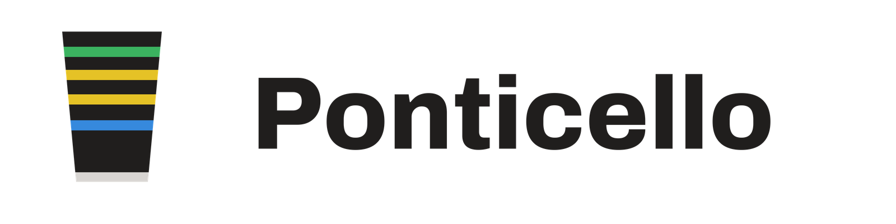

# The Ponticello mark



## The idea

*Ponticello* is Italian for "little bridge", and the mark is exactly that: a
cello bridge seen from the player's side, with the four strings running down
behind it.

- The **bridge** is reduced to what makes it a bridge rather than an arch or a
  tooth: the shallow arc of the crown (the curve that lets the bow reach one
  string without touching its neighbours), rounded shoulders, the waist where a
  real bridge has its kidney cuts, two feet with an arch between them, and the
  round **heart**.
- The **strings** — **C green, G red, D blue, A yellow** — are the colours the
  app gives those four strings everywhere: the fingerboard, the chart, the play
  screen. They run off the top edge and pass *behind* the bridge, thick enough
  to read as four colours at launcher size.
- Each carries a soft drop shadow, so the bridge stands in front of the
  strings and both lift off the indigo ground.

The bridge is symmetric about its centre line, like the iPhone Duo about its
hinge.

## The master

**`ponticello-icon.svg` is the master, drawn by hand in a vector editor.** It is
the only brand file anyone edits. It must keep three parts, which
`tools/make-icons.py` checks before it derives anything:

| Part | What the script looks for |
|---|---|
| Ground | a path filled with the indigo gradient |
| Strings | a group of exactly four string paths, drawn *before* the bridge |
| Bridge | a group containing one even-odd path (the heart is the hole) |

Then regenerate everything else:

```
python3 tools/make-icons.py
```

The script never writes the master. It reads it, splits it into those parts and
renders every variant with resvg (`tools/rasterize-svg.mjs`, a dev dependency),
because the master's drop-shadow filters and free-form paths are beyond Pillow.
It asserts what it cannot eyeball: that the bridge survives a circular Android
launcher mask, that the themed icon is truly one colour, and that the heart is
still open at 48 px. Set `ICON_PREVIEW_DIR` to also get 32/48/96/180 px
previews.

## Colours

| Role | Hex |
|---|---|
| Ground, top → bottom (`BRAND.glow` → `BRAND.deep`) | `#7A6CFF` → `#2A1C9E` |
| Bridge (bleached maple) | `#FAF8F3` |
| Strings C / G / D / A | `#30D158` / `#FF453A` / `#64D2FF` / `#FFD60A` |
| Accent on light / dark (`BRAND.indigo` / `indigoLight`) | `#4638D6` / `#9C95FF` |
| Splash ground (`BRAND.midnight`) | `#0B0A14` |

D is drawn in cyan rather than system blue so it holds on the indigo ground.

## What is derived

| File | Size | Role |
|---|---|---|
| `assets/expo.icon/` | vector | iOS icon (Icon Composer): bridge in front, strings behind, as Liquid Glass layers at full bleed on the gradient |
| `assets/images/icon.png` | 1024² | base icon |
| `assets/images/android-icon-foreground.png` | 1024² | adaptive foreground: the mark unclipped, strings running off the mask |
| `assets/images/android-icon-background.png` | 1024² | adaptive background: the gradient |
| `assets/images/android-icon-monochrome.png` | 1024² | Android 13 themed icon: one-colour silhouette |
| `assets/images/splash-icon.png` | 512² | splash, the tile on the midnight ground |
| `assets/images/favicon.png` | 48² | web |
| `assets/logo/ponticello-mark.svg` | vector | the mark without its tile |
| `assets/logo/ponticello-icon-512.png` | 512² | the tile, for the README and the in-app brand line |
| `assets/logo/ponticello-wordmark.png` | 1600×400 | icon and name, dark ink |
| `assets/logo/ponticello-wordmark-light.png` | 1600×400 | icon and name, light ink |
| `docs/assets/brand/*` | — | the site's copies, a full-bleed Apple touch icon and the link preview |

The iOS layers leave the master's drop shadows out: Icon Composer draws its own
per layer, and doubling them muddies the glass. Icon Composer reads a layer's
width and height as points on its 1024-point canvas, so the layers are written
at 1024 — a bare 100-unit viewBox renders as a speck, which is what the 1.7
icon did.
